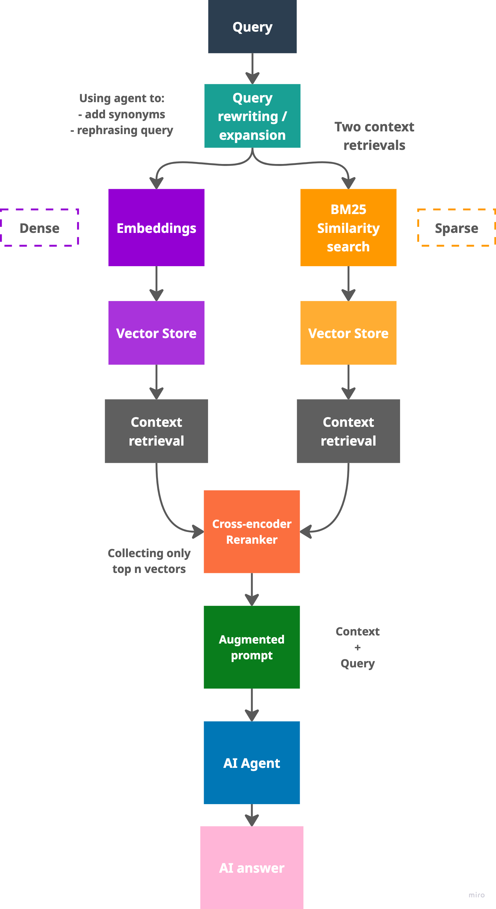

# DSCI_575_project_eligoze_jlu9402

Building a Smart Amazon Product Query Assistant



## Project structure

```bash
DSCI_575_project_eligoze_jlu9402/
│
├── README.md
├── environment.yml
├── .env
│
├── data/
│   ├── raw/
│   └── processed/
│
├── notebooks/
│   └── milestone1_exploration.ipynb
│
├── src/
│   ├── bm25.py
│   ├── semantic.py
│   └── retrieval_metrics.py
│
│── results/
│   └── milestone1_discussion.md
│
├── app/
    └── app.py
```
